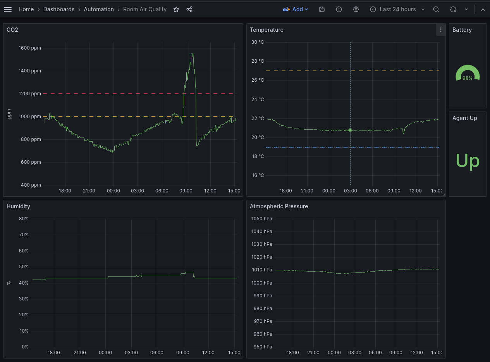

# CO2/Air Quality Home Monitoring

Monitor home air quality metrics (CO2, temperature, humidity, etc.) using Aranet4 sensor, Raspberry Pi, Prometheus and Grafana



## Requirements

- Raspberry Pi (or bluetooth-capable device)
- Aranet4 Sensor (or [any other](https://github.com/topics/co2-monitor) bluetooth-capable CO2 sensor)
- Prometheus + Grafana instance (e.g. using free [Grafana Cloud account](https://grafana.com/products/cloud/))

## Quick Start

- TODO - link article
- TODO - Dashboard screenshot

### RPi

To find IP if it changed:

```shell
nmap -sn 192.168.1.0/24
Starting Nmap 7.80 ( https://nmap.org ) at 2023-12-14 14:20 CET
...
Nmap scan report for raspberrypi (192.168....)
Host is up (0.0048s latency).
...
Nmap done: 256 IP addresses (3 hosts up) scanned in 2.51 seconds
```

To access:

- Update `~/.ssh/config`, e.g.:

```shell
Host rpi
	Hostname 192.168....
	User pi
```

- Then use `ssh rpi` or `ssh pi@rpi` to connect.
- Also set the IP in `ansible/inventory` file.

To set up RPi:

- Populate `ansible/files/.env`
- Run:

```shell
cd ansible
ansible-playbook rpi.yaml
```

The above playbook install Docker, `docker-compose` and bluetooth-related packages.

### Bluetooth

Find Aranet4 MAC:

```shell
ssh pi
sudo su -
systemctl start hciuart  # or enable
bluetoothctl
> power on
> agent on
> scan on
[NEW] Device DD:...:1F Aranet4 26D0F
> scan off
> pair DD:...:1F
# enter PIN displayed on Aranet4 device
> trust DD:...:1F
> agent off
> quit
```

### Aranet Agent

Deploy with Ansible:

```shell
ansible-playbook aranet.yaml --extra-vars "aranet_device='DD:...:1F=office' aranet_interval=60"
```

Or deploy manually

```shell
wget https://github.com/MartinHeinz/aranet4-exporter-go/releases/download/v1.0.1/aranet4-exporter_1.0.1_linux_armv6.deb
dpkg -i aranet4-exporter_1.0.1_linux_armv6.deb
vim /etc/default/aranet4-exporter

# Set:
# LISTEN=0.0.0.0:9100
# DEVICES="-device DD:...:1F=office"
# INTERVAL=...

systemctl restart aranet4-exporter

curl http://localhost:9100/metrics | grep aranet

# Should show something like:
# aranet4_co2_ppm{room="office"} 995
# ...
```

### Grafana

At this point metrics should be flowing to Prometheus. To visualize them you can use (import) the included [Grafana dashboard](grafana/aranet-grafana-dashboard.json) into your Grafana instance.

Considerations:
- The dashboard assumes Prometheus datasource is named `DS_GRAFANACLOUD-PROM`, you will need to change that.
- Aranet4 measures _absolute humidity_, so it needs to be adjusted for altitude. The included dashboard adds `24` due my altitude, you will need to adjust that. Compare local weather station relative humidity with Aranet4 value to find the offset.

### Troubleshooting

- Agents can't read data from sensor via Bluetooth:
  - `systemctl restart hciuart` (might need to do it multiple times)

### Resources

- <https://superuser.com/questions/1160934/bluetoothctl-connects-and-disconnects-repeatedly>